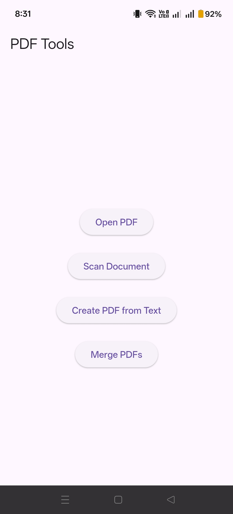

# flutter-pdf-viewer-app
A simple Flutter PDF viewer app that allows users to select and read PDF files on Android devices.
Features
-open PDF
-Merge PDF
-Scan PDF
Convert text to PDF
Build using Flutter
## App Screenshot
![App Screenshot] (app_screenshot.png)
# Flutter PDF Tool

This is a Flutter application that allows users to work with PDF files.

Features:
- Open PDF files
- Merge multiple PDFs
- Scan documents and convert to PDF
- Convert text into PDF

Built using Flutter and Dart.

## App Screenshot

